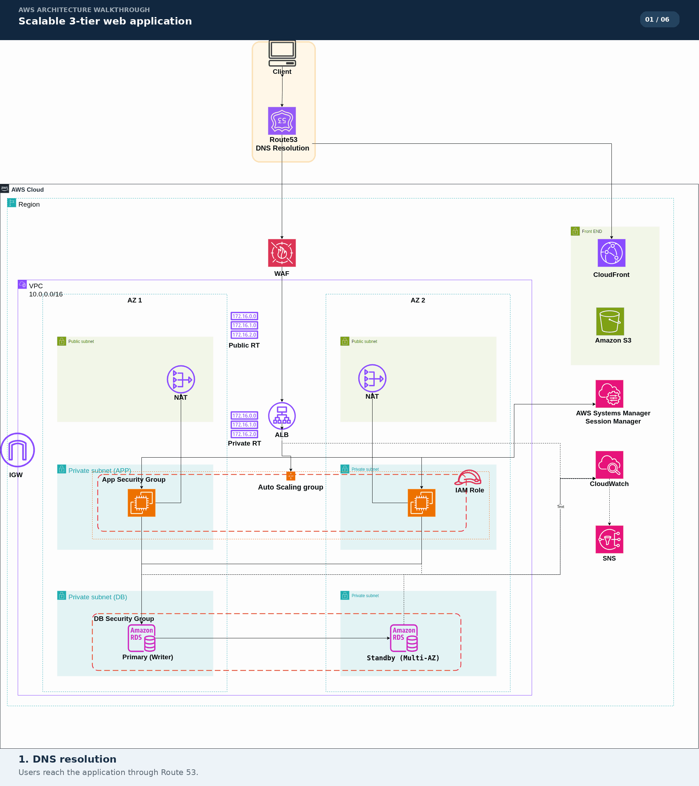

# Highly Available 3-Tier Web Application on AWS

This architecture separates a web application into a static frontend, an application tier, and a managed database tier. It uses two Availability Zones so the application and database can remain available through an instance or Availability Zone issue.

## Architecture Diagram

The animation highlights the main request path and supporting AWS services. The [static diagram](architecture.png) is included for a non-animated view.

## Solution Overview

The design places the static frontend behind Amazon CloudFront with Amazon S3 as its origin. Route 53 provides DNS, and AWS WAF protects application traffic before it reaches the load balancer. An Application Load Balancer distributes requests to EC2 instances managed by an Auto Scaling group in private application subnets. The application connects to an Amazon RDS database configured for Multi-AZ operation.

The VPC spans two Availability Zones. Internet Gateway and NAT Gateway routing provide internet access where needed, while security groups limit communication between tiers. CloudWatch, SNS, and Systems Manager Session Manager support monitoring, notifications, and instance administration.

## Architecture Components

### Frontend and edge delivery

- **Amazon S3** stores static frontend content.
- **Amazon CloudFront** delivers content to users from edge locations.
- **Amazon Route 53** resolves the application's DNS name.
- **AWS WAF** filters web requests before they reach the application load balancer.

### Application tier

- An **Application Load Balancer (ALB)** distributes incoming application requests across healthy EC2 instances.
- An **EC2 Auto Scaling group** runs application instances across both Availability Zones.
- The application instances run in private application subnets and use an application security group.

### Database tier

- **Amazon RDS** provides the managed database service.
- The diagram shows a primary writer and a Multi-AZ standby in separate private database subnets.
- The database security group keeps database access within the application tier.

### Networking and operations

- A VPC with CIDR block `10.0.0.0/16` spans two Availability Zones.
- Public and private subnets use separate route tables. An Internet Gateway serves public traffic, while NAT Gateways provide outbound internet access for private resources.
- **AWS Systems Manager Session Manager** provides an administrative access path to instances.
- **Amazon CloudWatch** monitors the environment, with **Amazon SNS** available for notifications.

## Request Flow

1. A user requests the application, and Route 53 resolves its domain name.
2. Static frontend content is delivered through CloudFront from the S3 bucket.
3. Application requests pass through AWS WAF to the ALB.
4. The ALB forwards requests to healthy EC2 instances in the Auto Scaling group across the two Availability Zones.
5. The application accesses the database over private network paths. RDS maintains a standby in the other Availability Zone for Multi-AZ availability.
6. CloudWatch monitors resources and can publish notifications through SNS. Administrators can connect to instances with Session Manager.

## Availability and Security

- Application instances are distributed across two Availability Zones and managed by Auto Scaling.
- The ALB routes traffic to healthy application instances.
- RDS Multi-AZ maintains a standby database in a separate Availability Zone.
- Application and database resources are placed in private subnets, with security groups controlling tier-to-tier access.
- WAF filters incoming web requests, and NAT Gateways provide outbound access without placing application instances directly on the internet.
